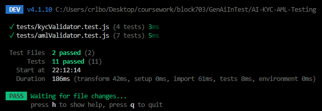
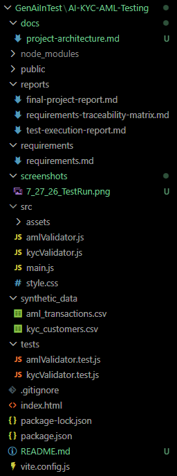

# AI KYC & AML Banking Platform Testing Framework


## Project Overview

This project demonstrates the use of Generative AI tools to assist in designing and implementing a Quality Assurance testing framework for an AI-powered KYC (Know Your Customer) and AML (Anti-Money Laundering) banking platform.

The project covers the complete testing lifecycle:

- Requirements gathering
- Synthetic test data generation
- Test scenario creation
- Automated JavaScript testing
- Requirements Traceability Matrix (RTM)
- Test execution reporting

---

# Technology Stack

| Technology | Purpose                     |
| ---------- | --------------------------- |
| JavaScript | Application logic           |
| Vite       | Development environment     |
| Vitest     | Automated testing framework |
| Node.js    | Runtime environment         |
| Git/GitHub | Version control             |

---

# Project Structure

```
AI-KYC-AML-Testing
│
├── reports
│   ├── requirements-traceability-matrix.md
│   ├── test-execution-report.md
│   └── final-project-report.md
│
├── requirements
│   └── requirements.md
│
├── synthetic_data
│   ├── kyc_customers.csv
│   └── aml_transactions.csv
│
├── src
│   ├── kycValidator.js
│   └── amlValidator.js
│
├── tests
│   ├── kycValidator.test.js
│   └── amlValidator.test.js
│
└── vite.config.js
```

---

# Features Tested

## KYC Validation

The framework validates:

- Customer identity information
- SSN formatting
- Customer risk levels
- Enhanced due diligence requirements

---

## AML Monitoring

The framework validates:

- Large transactions
- High-risk countries
- Suspicious transaction patterns
- Structuring behavior
- AML risk scoring

---

# Running the Project

Install dependencies:

```bash
npm install
```

Run automated tests:

```bash
npm test
```

---

# Test Results

Latest automated test execution:

```
Test Files: 2 passed

Tests: 11 passed

Pass Rate: 100%
```

---

# Generative AI Usage

Generative AI was used to assist with:

- Requirements generation
- Synthetic KYC data creation
- Synthetic AML scenario creation
- Test case generation
- Documentation creation

All generated content was reviewed and validated before implementation.

---

# Future Improvements

Potential future enhancements:

- AI chatbot integration testing
- NLP accuracy testing
- API integration testing
- Performance testing
- Security testing
- Database integration

---

# Screenshots

## Automated Test Execution



## Project Structure

## 

# Author

Corey Lockard

```

```
