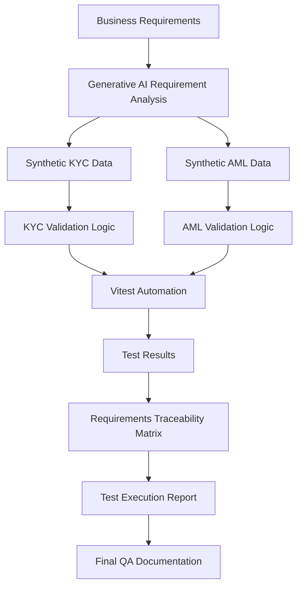

# System Architecture

```mermaid
flowchart TD

A[Business Requirements]
--> B[Generative AI Requirement Analysis]

B --> C[Synthetic KYC Data]
B --> D[Synthetic AML Data]

C --> E[KYC Validation Logic]
D --> F[AML Validation Logic]

E --> G[Vitest Automation]
F --> G

G --> H[Test Results]

H --> I[Requirements Traceability Matrix]

I --> J[Test Execution Report]

J --> K[Final QA Documentation]
```
